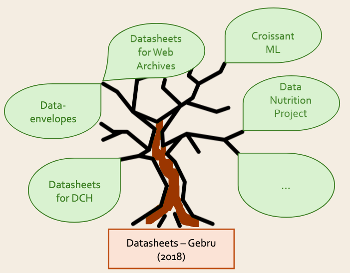

# data-envelopes
This site provides resources for learning about rich dataset documentation in general, and data-envelopes in particular

## What is rich dataset documentation, and why do we need it?
Dataset documentation, such as the dataset title, description, topics and licence, is essential to find relevant datasets. However, when a dataset user needs to assess the suitability of a dataset for their purposes, they require more information. For example, how was the dataset created, does it contain errors or biases, which uses are permitted? When a dataset user decides to use a dataset, they require different information again, such as where can they download it, how is the data structured, how should they credit the dataset creators?

Rich dataset documentation contains the information users need to not only find a dataset, but to understand it and use it responsibly.

## What is a data-envelope?
Cultural heritage datasets are very interesting to humanities researchers, machine learning researchers and members of the public. At the same time, these datasets often have a complex history, may be missing data, contain biases or offensive language and may be difficult to use. In tests with cultural heritage datasets, researchers at Huygens Institute found that existing documentation initiatives didn't properly cover the complexity of cultural heritage datasets. For this reason, we are extending the existing [datasheet](https://arxiv.org/abs/1803.09010) concept for dataset documentation with particular attention to the specific challenges of cultural heritage datasets. We call this extended version of datasheets a 'data-envelope'.

For more details, read [The data-envelope concept](concept.md).

## Didn't someone else already do this?
There are many dataset documentation formats available. This is because different domains require different sorts of information about the dataset. Many of these formats have grown from the [datasheet](https://arxiv.org/abs/1803.09010) concept, while others have developed their own approach. 

Data-envelopes focus on the cultural heritage domain. Another documentation concept, the ['Datasheets for DCH' template](https://pro.europeana.eu/project/datasheets-for-digital-cultural-heritage-working-group), being developed by Europeana, is also aimed at the cultural heritage domain. We are working together with the Europeana working group to ensure our concepts are interoperable with each other, while allowing users freedom to choose the format that best suits their needs. 

Both data-envelopes and datasheets for DCH build on existing standards such as [DCAT3](https://www.w3.org/TR/vocab-dcat-3/), and support the [FAIR](https://www.go-fair.org/fair-principles/) principles. We are working on interoperability with other relevant standards (such as the requirements for datasets in the [NDE Dataset register](https://docs.nde.nl/requirements-datasets/)), 

Data-envelopes are being developed by the [Huygens Institute](https://www.huygens.knaw.nl), in conjunction with the broader cultural heritage community. We are in touch with many related initiatives. Do you know of a related initiative that's not yet in our [list](related_initiatives.md)? Please [let us know](contact.md)!

## Information
* [The data-envelope concept](concept.md)
* [Tools](tools.md)
* [Examples, guidelines and literature](learning_materials.md)
* [Projects](projects.md)
* [Related initiatives](related_initiatives.md)
* [News and events](news_and_events.md)
* [Results](results.md)
* [Get in touch](contact.md)
* [Acknowledgements](acknowledgements.md)
