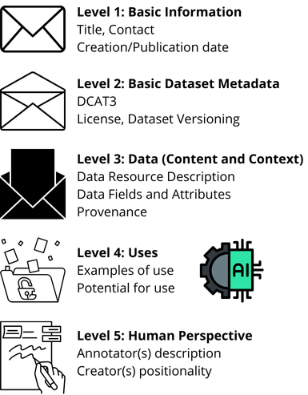

# Data-envelopes concept
The concept of data-envelopes was first introduced in the 2024 paper ["Data-Envelopes for Cultural Heritage: Going beyond Datasheets"](https://aclanthology.org/2024.legal-1.9/) by Mrinalini Luthra and Maria Eskevich.

A data-envelope has a modular structure to make it easier to find relevant information. This structure consists of five levels:

## Level 1: Basic information
Level 1 of a data-envelope identifies the data-envelope and indicates who to talk to for more information.

Contents:
* Envelope Title
* Contact person
* Email address
* Creation and publication dates

## Level 2: Basic dataset metadata
Level 2 provides basic metadata about the dataset, telling you what the dataset comprises, who made it, where you can find it and under which conditions you can use it. This level makes the data-envelope compatible with the DCAT3 standard.

Contents:
* Snapshot - what is in the dataset?
  * Dataset Title
  * Version
  * Dataset URL
  * Description of what is in the dataset
  * Topic and genres
  * Geographical and temporal coverage
* Dates - when was the dataset made/published?
  * Creation and publication dates
* Contributors - who was involved in producing the dataset?
  * Publishers
  * Contributors
  * Funding sources
* Distribution - where can you find the dataset?
  * Dataset link
  * DOI
  * Repository
  * Download information
  * Citation information
* Access/licenses - Under what conditions can you use this dataset?
  * Licensing information
  * Access level
  * Access controls
* Dataset version and maintenance - What is the status of the dataset?
  * Version details
  * Maintenance status
  * Maintenance plan
  * Next planned updates

## Level 3: Data
Level 3 dives deeper into the data itself, describing how it was created and the details of its structure and elements. It also highlights possible concerns about the dataset such as social impact, sensitivity and bias. 

A dataset can contain multiple Data Resources. For example, it could contain a file listing the persons in the dataset, a file listing diary entries in the dataset, and a file listing which persons occur in which diary entry. The information in this section can be filled in for each Data Resource. 

Contents:
* Data Resource Description - More detail about the dataset, and how it was produced
  * Name of resource
  * Description of how it was produced
  * Languages
  * Technical information - path, format, size, date, modality and encoding
  * Data subjects
  * Descriptive statistics
* Data fields and attributes - The individual data fields
  * Summary
  * Vocabularies used
  * Data field description
  * Example of a typical data point
  * Example of an atypical datapoint
  * Any errors, noise or redundancies
  * Links to external resources
 * Annotation and labelling - ??
   * Annotation workforce 
   * Annotation characteristics
 * Social impact, sensitivity and biases - Potential issues with using the data
   * Offensive data
   * Confidential data
   * Known biases
   * Attributes that are sensitive or unintentionally collected
   * Ethical review information
 * Data Provenance - what sources were reused in this dataset?
   * Name
   * Path
   * Description
   * Creations
   * Year of publication
   * Language
   * Temporal and geographical scope
   * Notable features
   * Datasheet/data-envelope
   * Data selection criteria
 * Digitisation pipeline

## Level 4: Uses
Level 4 discusses the uses of the dataset: existing uses, suitable uses and unsuitable uses. It also lists characteristics that may affect its use.

Content:
* Uses - how the dataset can and can't be used
  * Types of use it is safe for
  * Suitable use cases
  * Unsuitable use cases
  * Links to a repository with use information
  * Links to related datasets, publications or models
* Use with other data - how the dataset can or can't be used in combination with other data
   * Safety level
   * Known safe datasets
   * Known unsafe datasets
   * Best practices
   * Limitations and recommendations
* Use in ML or AI systems
   * Dataset uses
   * Notable features
   * Known correlations
   * Data splits
* Sampling
  * Safety level
  * Best practices
  * Acceptable sampling methods
  * Risks and mitigations

## Level 5: Human Perspective
Level 5 looks at the human perspectives that could have influenced the dataset

Content:
* Annotator descriptions
* Creators

